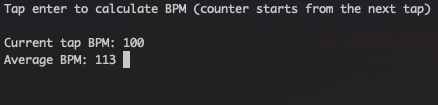

# Tap BPM for CLI (GO)
Tap your Enter key to calculate Beats Per Minute. It shows curent tap BPM and average BPM.
Tool for CLI written in GOlang.

## Prerequisites
 - go (https://golang.org/) any version. Can be installed via `brew install golang`
 - any OS with working CLI

## Run
 - Clone this repository or download zip
 - Run `go run tap-bpm-cli.go`

## OR

## Build binary
 - Run `go build tap-bpm-cli.go`
 - This will build the tap-bpm-cli executable in current directory that you can run. Just type `./tap-bpm-cli`
